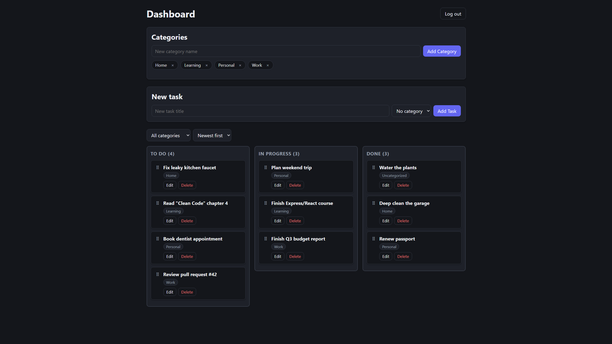

# Taskflow

A full-stack task and habit tracker with authentication, categories, and a drag-and-drop status board. Built as a portfolio project to demonstrate a complete Express + React + PostgreSQL stack, containerized with Docker.

## About The Project

Taskflow lets a user register, log in, and manage tasks across three states (To do, In progress, Done) using a Kanban-style board. Tasks can be grouped into user-defined categories, filtered, and sorted. Every request is scoped to the logged-in user, so one account can never see or modify another account's data.

### Core Features

- Email/password registration and login with JWT-based authentication
- Full task CRUD: create, edit, delete, and drag tasks between status columns
- User-defined categories, with tasks filterable by category or "uncategorized"
- Sort tasks by creation date (newest or oldest first)
- Automatic logout when a session token expires
- Responsive layout with light/dark theme support
- Fully containerized with Docker Compose, including an nginx reverse proxy

### Screenshot



## Built With

- **Frontend:** React (Vite), React Router, Axios, @dnd-kit
- **Backend:** Node.js, Express
- **Database:** PostgreSQL
- **Auth:** JSON Web Tokens, bcrypt
- **Testing:** Jest, Supertest
- **Infrastructure:** Docker, Docker Compose, nginx

## Prerequisites

- [Docker](https://www.docker.com/) and Docker Compose (bundled with Docker Desktop)

That's the only requirement for the recommended setup below. Running the app without Docker additionally requires Node.js 20+ and a local PostgreSQL instance; see [Running without Docker](#running-without-docker).

## How to Run

### 1. Clone the repository

```bash
git clone https://github.com/ababitsbence/taskflow-express-react.git
cd taskflow-express-react
```

### 2. Create your environment file

Copy the example file and fill in your own values:

```bash
cp .env.example .env
```

| Variable | Description |
|---|---|
| `DB_USER` | Postgres username created inside the container |
| `DB_PASSWORD` | Postgres password created inside the container |
| `DB_NAME` | Database name |
| `JWT_SECRET` | Any long random string, used to sign login tokens |

### 3. Run the start script

**Windows (PowerShell):**
```powershell
./run.ps1
```

**macOS / Linux:**
```bash
./run.sh
```

Either script builds and starts all four containers (PostgreSQL, the Express API, the React app, and an nginx reverse proxy) and applies the database schema automatically on first run.

### 4. Open the app

Visit **http://localhost:8080** and register a new account to get started.

To stop the app:
```bash
docker compose down
```

### Running without Docker

<details>
<summary>Expand for manual setup instructions</summary>

**Backend:**
```bash
cd server
npm install
cp .env.example .env   # fill in DATABASE_URL, JWT_SECRET, PORT
psql -U postgres -c "CREATE DATABASE task_tracker;"
psql -U postgres -d task_tracker -f db/schema.sql
npm run dev
```

**Frontend** (in a separate terminal):
```bash
cd client
npm install
npm run dev
```

The frontend will be available at `http://localhost:5173` and will talk to the backend directly at `http://localhost:3000`.

</details>

## Running Tests

The backend has an automated test suite covering authentication, task CRUD, categories, and cross-user data isolation (28 tests across 3 suites).

```bash
cd server
npm install
createdb task_tracker_test   # or: psql -U postgres -c "CREATE DATABASE task_tracker_test;"
psql -U postgres -d task_tracker_test -f db/schema.sql
cp .env.test.example .env.test   # fill in a test DATABASE_URL and JWT_SECRET
npm test
```

Tests run against a separate database from development, and are never run against production data.

## Project Structure

```
taskflow-express-react/
├── client/          React frontend (Vite)
├── server/          Express API, PostgreSQL access, JWT auth
│   └── tests/       Jest + Supertest test suite
├── nginx/           Reverse proxy config used by docker-compose
├── docker-compose.yml
├── run.sh / run.ps1
└── README.md
```


## Roadmap / Future Improvements

- [ ] Manual drag-to-reorder within a status column
- [ ] Task priority levels
- [ ] Deployment to a public URL
- [ ] Refresh tokens instead of a single long-lived JWT

## License

This project was built as a personal portfolio piece and is not licensed for production use.